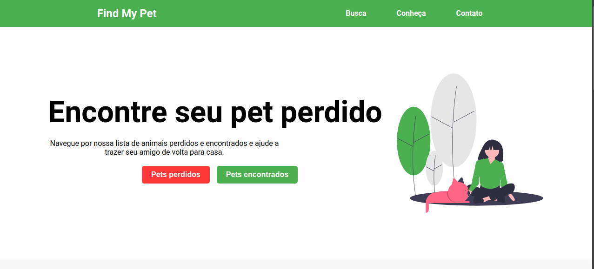
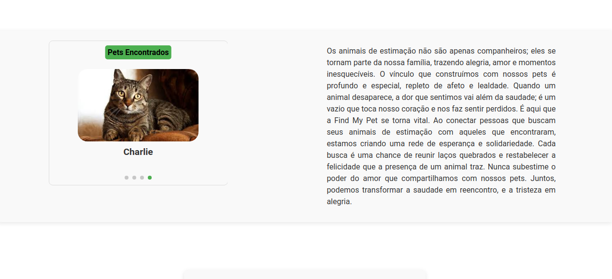
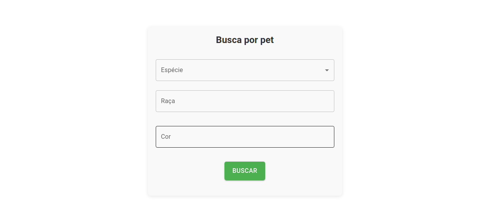
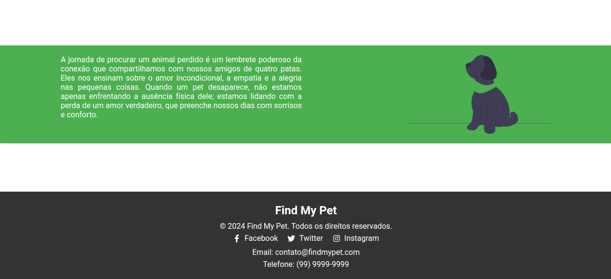
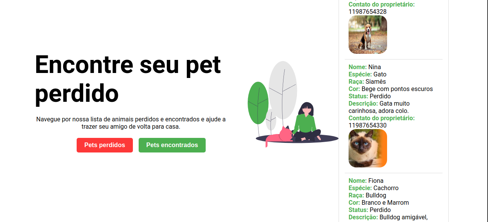
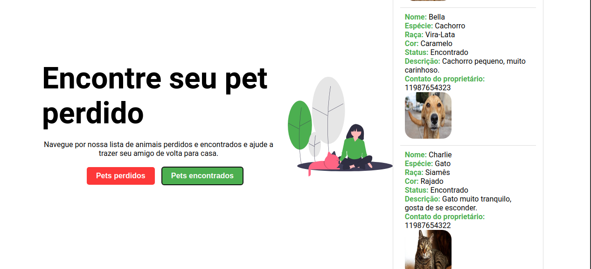
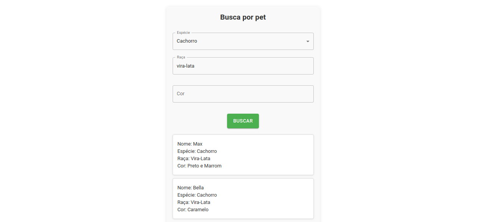

# FindMyPet - Aplicação Fullstack 🐶🐱🔍

A FindMyPet é uma aplicação fullstack desenvolvida para ajudar donos de animais de estimação a localizarem seus pets perdidos. A aplicação inclui tanto uma API backend para o gerenciamento de dados dos animais, quanto um frontend que permite uma interação intuitiva e fácil para os usuários.

# 📋 Tecnologias Utilizadas
* Backend: Node.js (v22.1.0), Express.js (v4.19.2)
* Frontend: React.js (v18.3.1), Vite (v5.4.1), Axios (v1.7.7)
* Database: MongoDB Atlas
* Hospedagem: API hospedada no Render e frontend no Vercel
* Outras ferramentas: Axios para consumo de API, Material UI para componentes estilizados.


# 🔧 Instalação
1 - Clone o repositório do frontend:

``` 
git clone https://github.com/anacamorims/findMyPet-frontend 
```

2 - Instale as dependências do frontend:

```
npm install
```

3 - Inicialize o servidor frontend:
```
npm run dev
```
Por padrão, o frontend estará disponível em http://localhost:5173.

# ⚙️ API Utilizada

Foi utilizada a API:

FindMyPet: 
https://github.com/anacamorims/findMyPet-api

Hospedada em:
https://findmypet-api.onrender.com/

# 📍 Rotas da API utilizadas 

### Foram utilizadas três rotas GET:

#### Buscar Animais por Parâmetros
* Rota: ```/animais?```
* Método HTTP: GET
* Descrição: Lista animais pelos parâmetros fornecidos.

#### Buscar Todos Animais Perdidos
* Rota: ```/animais/perdidos```
* Método HTTP: GET
* Descrição: Lista todos animais com status perdido.    

#### Buscar Todos Animais Encontrados
* Rota: ```/animais/encontrados```
* Método HTTP: GET
* Descrição: Lista todos animais com status encontrado.

# 🖼️ Screenshots
Aqui estão algumas imagens da interface da aplicação para visualização:

Interface:






Lista de Pets Perdidos:



Lista de Pets Encontrados:




Busca por Detalhes:




#### 🖇️ Aplicação desenvolvida como Miniprojeto para o M5 da Programadores do Amanhã